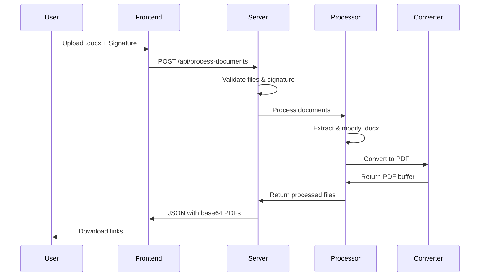

# 🔧 Documentação Técnica - ExactSign v2.0

## 📋 Dependências Completas

### 🔧 Backend Dependencies (package.json)

```json
{
  "dependencies": {
    "cors": "^2.8.5",                    // CORS middleware
    "express": "^4.18.2",               // Framework web
    "express-rate-limit": "^7.1.5",     // Rate limiting
    "fs-extra": "^11.2.0",              // Sistema de arquivos estendido
    "helmet": "^7.1.0",                 // Headers de segurança
    "jszip": "^3.10.1",                 // Manipulação de arquivos ZIP
    "mammoth": "^1.6.0",                // Conversão Word para HTML
    "multer": "^1.4.5-lts.1",          // Upload de arquivos
    "puppeteer": "^21.5.2",             // Automação de browser
    "sharp": "^0.33.0",                 // Processamento de imagens
    "uuid": "^9.0.1",                   // Geração de UUIDs
    "xml2js": "^0.6.2"                  // Parser XML/JSON
  }
}
```

### 🎨 Frontend Dependencies (CDN)

```html
<!-- Fontes Google -->
<link href="https://fonts.googleapis.com/css2?family=Inter:wght@300;400;500;600;700" rel="stylesheet">

<!-- Ícones Lucide -->
<script src="https://unpkg.com/lucide@latest/dist/umd/lucide.js"></script>
```

## 🏗️ Estrutura de Arquivos Detalhada

```
📁 ExactSign/
├── 📄 README.md                    # Documentação principal
├── 📄 SECURITY.md                  # Documentação de segurança
├── 📄 LICENSE                      # Licença comercial
├── 📄 DOCS.md                      # Esta documentação técnica
│
├── 🔧 api/                         # Backend Node.js
│   ├── 📋 config/
│   │   └── security.js             # Rate limiting, Helmet, validações
│   ├── 🛡️ middleware/
│   │   └── validation.js           # Validação de arquivos e sanitização
│   ├── ⚙️ services/
│   │   ├── documentProcessor.js    # Orquestração do processamento
│   │   ├── pureWordProcessor.js    # Manipulação de arquivos .docx
│   │   └── purePDFConverter.js     # Conversão Word → HTML → PDF
│   ├── 📦 package.json             # Dependências e scripts
│   ├── 📦 package-lock.json        # Lock de versões
│   ├── 🚀 server.js               # Servidor Express principal
│   └── 💾 install.bat             # Script de instalação Windows
│
└── 🎨 web/                        # Frontend Vanilla
    ├── 🏠 index.html              # Interface principal SPA
    ├── 🎨 styles.css              # Estilos CSS3 responsivos
    ├── ⚡ script.js               # Lógica JavaScript ES6+
    └── 🖼️ exactsign-logo.png      # Logo da aplicação
```

## 🔄 Fluxo de Processamento



## 🔒 Configurações de Segurança

### Rate Limiting
```javascript
// config/security.js
const general = rateLimit({
  windowMs: 15 * 60 * 1000,  // 15 minutos
  max: 100,                   // 100 requests
  message: 'Muitas requisições'
});

const upload = rateLimit({
  windowMs: 5 * 60 * 1000,   // 5 minutos  
  max: 10,                    // 10 uploads
  message: 'Limite de uploads excedido'
});
```

### Helmet Headers
```javascript
helmet({
  contentSecurityPolicy: {
    directives: {
      defaultSrc: ["'self'"],
      styleSrc: ["'self'", "'unsafe-inline'", "https://fonts.googleapis.com"],
      fontSrc: ["'self'", "https://fonts.gstatic.com"],
      scriptSrc: ["'self'", "https://unpkg.com"],
      imgSrc: ["'self'", "data:", "blob:"],
      connectSrc: ["'self'"]
    }
  }
})
```

## 📊 Endpoints da API

### POST /api/process-documents
**Processa documentos com assinatura**

**Request:**
```javascript
FormData {
  documents: File[],           // Arquivos .docx (máx 10MB cada)
  signature?: File,            // Imagem da assinatura (opcional)
  signatureData?: string       // Base64 do canvas (opcional)
}
```

**Response:**
```javascript
{
  success: boolean,
  files: [{
    name: string,              // Nome do arquivo PDF
    data: string,              // PDF em base64
    size: number               // Tamanho em bytes
  }],
  error?: string              // Mensagem de erro (se houver)
}
```

### GET /api/health
**Status da aplicação**

**Response:**
```javascript
{
  status: "OK",
  version: "2.0.0", 
  timestamp: "2024-01-01T00:00:00.000Z"
}
```

### GET /api/system-check
**Verificação de dependências**

**Response:**
```javascript
{
  success: boolean,
  system: {
    ready: boolean,
    checks: {
      puppeteer: { available: boolean },
      tempDir: boolean,
      sharp: boolean
    },
    recommendations: string[]
  }
}
```

## 🛠️ Scripts de Desenvolvimento

### package.json Scripts
```json
{
  "scripts": {
    "start": "node server.js",
    "dev": "nodemon server.js", 
    "prod": "NODE_ENV=production node server.js"
  }
}
```

### Comandos Úteis
```bash
# Desenvolvimento com auto-reload
npm run dev

# Produção
npm run prod

# Instalar apenas dependências de produção
npm install --production

# Verificar vulnerabilidades
npm audit

# Corrigir vulnerabilidades
npm audit fix

# Limpar cache npm
npm cache clean --force
```

## 🔧 Configuração de Ambiente

### Desenvolvimento
```bash
# .env.development
NODE_ENV=development
PORT=3001
DEBUG=exactsign:*
CORS_ORIGIN=*
```

### Produção
```bash
# .env.production  
NODE_ENV=production
PORT=3001
CORS_ORIGIN=https://seu-dominio.com
```

## 📱 Frontend - Estrutura JavaScript

### Classes Principais
```javascript
class DocuSignPro {
  constructor() {
    this.documents = [];           // Arquivos selecionados
    this.signature = null;         // Dados da assinatura
    this.signatureType = 'draw';   // 'draw' ou 'upload'
    this.canvas = null;            // Canvas HTML5
    this.strokes = [];             // Traços da assinatura
    this.API_BASE = 'http://localhost:3001/api';
  }
  
  // Métodos principais
  handleFileSelect(files)        // Upload de arquivos
  processDocuments()             // Envio para API
  setupCanvas()                  // Configuração do canvas
  displayResults(files)          // Exibição dos resultados
}
```

### Event Listeners
```javascript
// Upload de arquivos
document.getElementById('documents').addEventListener('change', handleFileSelect);

// Canvas de assinatura  
canvas.addEventListener('mousedown', startDrawing);
canvas.addEventListener('mousemove', draw);
canvas.addEventListener('mouseup', stopDrawing);

// Navegação entre steps
document.getElementById('nextStep1').addEventListener('click', () => goToStep(2));
```

## 🎨 CSS - Estrutura de Estilos

### Variáveis CSS
```css
:root {
  /* Cores principais */
  --primary-500: #3b82f6;
  --primary-600: #2563eb;
  --success-500: #10b981;
  --error-500: #ef4444;
  
  /* Espaçamentos */
  --space-1: 0.25rem;
  --space-2: 0.5rem;
  --space-4: 1rem;
  
  /* Bordas */
  --radius-md: 0.5rem;
  --radius-lg: 0.75rem;
}
```

### Componentes Principais
```css
.corporate-header          /* Header da aplicação */
.progress-container        /* Barra de progresso */
.step-content             /* Conteúdo de cada step */
.upload-zone              /* Área de upload */
.signature-workspace      /* Área de assinatura */
.canvas-wrapper           /* Container do canvas */
.download-grid            /* Grid de downloads */
```

## 🔍 Debugging e Logs

### Console Logs
```javascript
// Frontend
console.log('Adicionando documento:', doc.name, doc.size);
console.log('Enviando requisição para:', API_BASE);
console.log('Resposta do servidor:', result);

// Backend  
console.log(`Processando: ${doc.originalname}`);
console.log(`Assinaturas inseridas: ${insertionsMade}`);
console.error('Erro no processamento:', error);
```

### Debug Mode
```bash
# Habilitar debug detalhado
DEBUG=exactsign:* npm start

# Debug específico
DEBUG=exactsign:server npm start
DEBUG=exactsign:processor npm start
```

## 🚀 Deploy e Produção

### Docker (Opcional)
```dockerfile
FROM node:16-alpine

WORKDIR /app
COPY api/package*.json ./
RUN npm install --production

COPY api/ .
COPY web/ ./public/

EXPOSE 3001
CMD ["npm", "start"]
```

### PM2 Ecosystem
```javascript
// ecosystem.config.js
module.exports = {
  apps: [{
    name: 'exactsign',
    script: 'server.js',
    cwd: './api',
    instances: 1,
    env: {
      NODE_ENV: 'development',
      PORT: 3001
    },
    env_production: {
      NODE_ENV: 'production', 
      PORT: 3001
    }
  }]
};
```

## 📊 Monitoramento

### Métricas Importantes
- **CPU Usage**: Monitorar picos durante conversão PDF
- **Memory Usage**: ~100MB por conversão simultânea
- **Disk I/O**: Limpeza de arquivos temporários
- **Network**: Upload/download de arquivos grandes
- **Error Rate**: Taxa de falhas no processamento

### Logs de Produção
```bash
# PM2 Logs
pm2 logs exactsign --lines 100

# Logs por data
pm2 logs exactsign --timestamp

# Monitoramento em tempo real
pm2 monit
```

---

**📝 Nota**: Esta documentação técnica complementa o README principal e deve ser atualizada conforme novas funcionalidades são adicionadas.