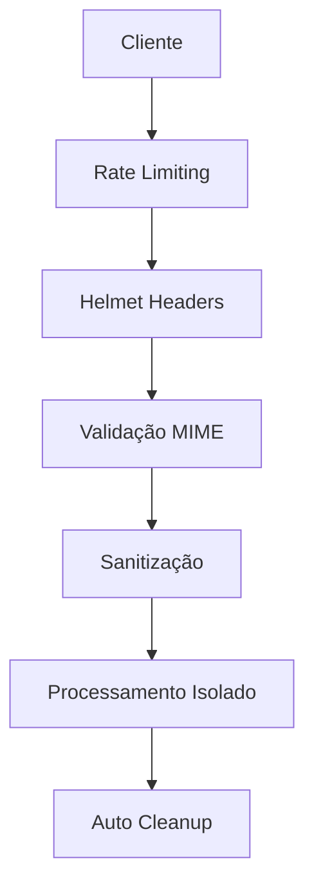

# 🔐 ExactSign v2.0 - Sistema Profissional de Assinatura Digital

<div align="center">


**Sistema empresarial completo para processamento de documentos Word (.docx) com assinatura digital e conversão para PDF**

[](https://nodejs.org/)
[](LICENSE)
[](package.json)
[](SECURITY.md)

[🚀 Instalação](#-instalação-rápida) • [📖 Documentação](#-documentação) • [🔒 Segurança](#-segurança) • [🛠️ Suporte](#-suporte)

</div>

---

## 📋 Índice

- [✨ Funcionalidades](#-funcionalidades)
- [🏗️ Arquitetura](#️-arquitetura)
- [🚀 Instalação Rápida](#-instalação-rápida)
- [🎯 Como Usar](#-como-usar)
- [🛠️ Stack Tecnológica](#️-stack-tecnológica)
- [🔒 Segurança](#-segurança)
- [📊 API Endpoints](#-api-endpoints)
- [🔧 Configuração](#-configuração)
- [🐛 Troubleshooting](#-troubleshooting)
- [📈 Performance](#-performance)
- [📝 Licença](#-licença)

---

## ✨ Funcionalidades

### 🎯 **Principais**
- ✅ **Upload Seguro** - Múltiplos documentos Word (.docx) até 10MB cada
- ✅ **Detecção Automática** - Localiza marcadores de assinatura inteligentemente
- ✅ **Assinatura Dupla** - Desenho no canvas HTML5 ou upload de imagem
- ✅ **Processamento Real-time** - Conversão instantânea com validação
- ✅ **Conversão PDF** - Saída profissional com qualidade preservada
- ✅ **Download Seguro** - Arquivos processados com limpeza automática

### 🛡️ **Segurança**
- 🔒 **Rate Limiting** - Proteção contra spam (100 req/15min)
- 🔒 **Validação Rigorosa** - Verificação de integridade de arquivos
- 🔒 **Headers Seguros** - Helmet.js com CSP configurado
- 🔒 **Sanitização** - Limpeza de dados e nomes de arquivo
- 🔒 **Isolamento** - Processamento isolado por sessão (UUID)
- 🔒 **Auto-cleanup** - Remoção automática de arquivos temporários

### 🎨 **Interface**
- 📱 **Responsivo** - Design adaptável para todos os dispositivos
- 🌙 **Tema Duplo** - Modo claro e escuro
- 📊 **Progress Tracking** - Acompanhamento visual do processo
- 🎯 **UX Intuitiva** - Interface profissional e fácil de usar

---

## 🏗️ Arquitetura

```
📁 ExactSign/
├── 🔧 api/                    # Backend Seguro
│   ├── 📋 config/
│   │   └── security.js        # Configurações de segurança
│   ├── 🛡️ middleware/
│   │   └── validation.js      # Validações e sanitização
│   ├── ⚙️ services/
│   │   ├── documentProcessor.js   # Processamento principal
│   │   ├── pureWordProcessor.js   # Manipulação .docx
│   │   └── purePDFConverter.js    # Conversão PDF
│   ├── 📦 package.json        # Dependências do backend
│   ├── 🚀 server.js          # Servidor Express seguro
│   └── 💾 install.bat        # Instalação automatizada
└── 🎨 web/                   # Frontend Profissional
    ├── 🏠 index.html         # Interface principal
    ├── 🎨 styles.css         # Design corporativo
    ├── ⚡ script.js          # Lógica do cliente
    └── 🖼️ exactsign-logo.png # Logo oficial
```

---

## 🚀 Instalação Rápida

### 📋 **Pré-requisitos**

| Ferramenta | Versão | Download |
|------------|--------|----------|
| **Node.js** | 16+ | [nodejs.org](https://nodejs.org/) |
| **LibreOffice** | Qualquer | [libreoffice.org](https://www.libreoffice.org/) |
| **Git** | Qualquer | [git-scm.com](https://git-scm.com/) |

### 🔽 **1. Clone o Repositório**
```bash
git clone https://github.com/seu-usuario/exactsign.git
cd exactsign
```

### ⚙️ **2. Instalação Automática (Windows)**
```bash
cd api
install.bat
```

### 🐧 **2. Instalação Manual (Linux/Mac)**
```bash
# Instalar dependências
cd api
npm install --production

# Instalar LibreOffice (Ubuntu/Debian)
sudo apt-get install libreoffice

# Instalar LibreOffice (macOS)
brew install --cask libreoffice
```

### 🚀 **3. Executar**
```bash
# Desenvolvimento
npm run dev

# Produção
NODE_ENV=production npm start
```

### 🌐 **4. Acessar**
- **API**: http://localhost:3001
- **Web**: Abrir `web/index.html` no navegador
- **Health Check**: http://localhost:3001/api/health

---

## 🎯 Como Usar

### 📝 **Processo Simples em 4 Passos**

| Passo | Ação | Descrição |
|-------|------|-----------|
| **1️⃣** | **Upload** | Selecione documentos .docx (máx. 10MB cada) |
| **2️⃣** | **Assinatura** | Desenhe no canvas ou faça upload de imagem |
| **3️⃣** | **Revisão** | Confirme documentos e assinatura |
| **4️⃣** | **Download** | Receba PDFs assinados instantaneamente |

### 🔍 **Marcadores Suportados**
```
✅ ASSINATURA          ✅ LOCAL DA ASSINATURA
✅ SIGNATURE           ✅ SIGN HERE  
✅ ASSINAR AQUI        ✅ _______________
```

### 📱 **Interface Responsiva**
- **Desktop**: Experiência completa com drag & drop
- **Tablet**: Interface otimizada para touch
- **Mobile**: Funcionalidades essenciais preservadas

---

## 🛠️ Stack Tecnológica

### 🔧 **Backend (Node.js)**

| Tecnologia | Versão | Função |
|------------|--------|--------|
| **Express.js** | 4.18+ | Framework web robusto |
| **Multer** | 1.4+ | Upload seguro de arquivos |
| **Sharp** | 0.33+ | Processamento otimizado de imagens |
| **JSZip** | 3.10+ | Manipulação eficiente de .docx |
| **Puppeteer** | 21.5+ | Conversão confiável Word → PDF |
| **Helmet** | 7.1+ | Headers de segurança |
| **Express Rate Limit** | 7.1+ | Proteção contra spam |
| **Mammoth** | 1.6+ | Conversão Word → HTML |

### 🎨 **Frontend (Vanilla)**

| Tecnologia | Versão | Função |
|------------|--------|--------|
| **HTML5** | - | Canvas para assinatura |
| **CSS3** | - | Design responsivo profissional |
| **JavaScript ES6+** | - | Lógica pura (sem frameworks) |
| **Lucide Icons** | Latest | Ícones modernos |
| **Google Fonts** | - | Tipografia profissional |

---

## 🔒 Segurança

### 🛡️ **Camadas de Proteção**



### 📊 **Configurações de Segurança**

| Proteção | Configuração | Descrição |
|----------|--------------|-----------|
| **Rate Limit Geral** | 100 req/15min | Proteção contra spam |
| **Rate Limit Upload** | 10 uploads/5min | Controle de uploads |
| **Tamanho Máximo** | 10MB por arquivo | Prevenção de sobrecarga |
| **Tipos Permitidos** | .docx, .png, .jpg | Validação rigorosa |
| **Cleanup** | 5 segundos | Limpeza automática |

### 🔐 **Headers de Segurança**
- **CSP** (Content Security Policy)
- **HSTS** (HTTP Strict Transport Security)
- **X-Frame-Options** (Clickjacking Protection)
- **X-Content-Type-Options** (MIME Sniffing Protection)

---

## 📊 API Endpoints

### 🔗 **Endpoints Principais**

| Método | Endpoint | Descrição | Rate Limit |
|--------|----------|-----------|------------|
| `POST` | `/api/process-documents` | Processar documentos com assinatura | 10/5min |
| `GET` | `/api/health` | Status da aplicação | 100/15min |
| `GET` | `/api/system-check` | Verificar dependências | 100/15min |

### 📝 **Exemplo de Uso**

```javascript
// Upload e processamento
const formData = new FormData();
formData.append('documents', file1);
formData.append('documents', file2);
formData.append('signatureData', canvasDataURL);

const response = await fetch('/api/process-documents', {
    method: 'POST',
    body: formData
});

const result = await response.json();
// result.files contém os PDFs em base64
```

### 📋 **Resposta da API**

```json
{
  "success": true,
  "files": [
    {
      "name": "documento_assinado.pdf",
      "data": "base64_encoded_pdf_data",
      "size": 245760
    }
  ]
}
```

---

## 🔧 Configuração

### 🌍 **Variáveis de Ambiente**

```bash
# .env
NODE_ENV=production
PORT=3001
CORS_ORIGIN=https://seu-dominio.com
```

### 🔄 **Proxy Reverso (Nginx)**

```nginx
server {
    listen 443 ssl;
    server_name seu-dominio.com;
    
    # SSL Configuration
    ssl_certificate /path/to/cert.pem;
    ssl_certificate_key /path/to/key.pem;
    
    # API Proxy
    location /api/ {
        proxy_pass http://localhost:3001;
        proxy_set_header Host $host;
        proxy_set_header X-Real-IP $remote_addr;
        proxy_set_header X-Forwarded-For $proxy_add_x_forwarded_for;
        proxy_set_header X-Forwarded-Proto $scheme;
        
        client_max_body_size 50M;
        proxy_timeout 300s;
    }
    
    # Frontend
    location / {
        root /caminho/para/web;
        try_files $uri $uri/ /index.html;
        
        # Security Headers
        add_header X-Frame-Options "SAMEORIGIN" always;
        add_header X-Content-Type-Options "nosniff" always;
        add_header Referrer-Policy "no-referrer-when-downgrade" always;
    }
}
```

### 🔄 **Process Manager (PM2)**

```bash
# Instalar PM2
npm install -g pm2

# Iniciar aplicação
pm2 start server.js --name exactsign

# Configurar auto-start
pm2 startup
pm2 save

# Monitoramento
pm2 monit
```

---

## 🐛 Troubleshooting

### ❌ **Problemas Comuns**

| Problema | Causa | Solução |
|----------|-------|---------|
| **Erro de conversão PDF** | LibreOffice não instalado | Instalar LibreOffice e adicionar ao PATH |
| **Rate limit atingido** | Muitas requisições | Aguardar tempo especificado |
| **Upload falha** | Arquivo inválido/grande | Verificar formato .docx e tamanho <10MB |
| **CORS Error** | Origem não permitida | Configurar CORS no servidor |
| **Dependências faltando** | npm install incompleto | Executar `npm install --production` |

### 🔍 **Logs de Debug**

```bash
# Habilitar logs detalhados
DEBUG=exactsign:* npm start

# Verificar logs do PM2
pm2 logs exactsign

# Monitorar recursos
pm2 monit
```

### 🩺 **Health Checks**

```bash
# Verificar API
curl http://localhost:3001/api/health

# Verificar sistema
curl http://localhost:3001/api/system-check

# Testar upload
curl -X POST -F "documents=@test.docx" \
     -F "signatureData=data:image/png;base64,..." \
     http://localhost:3001/api/process-documents
```

---

## 📈 Performance

### ⚡ **Métricas de Performance**

| Métrica | Valor | Descrição |
|---------|-------|-----------|
| **Processamento** | 2-5s por documento | Tempo médio de conversão |
| **Memória** | ~100MB por conversão | Uso de RAM durante processamento |
| **Concorrência** | Múltiplos usuários | Suporte simultâneo |
| **Cleanup** | 5 segundos | Limpeza automática de arquivos |
| **Throughput** | 10 docs/min | Capacidade máxima recomendada |

### 🚀 **Otimizações**

- **Processamento Paralelo**: Múltiplos documentos simultaneamente
- **Cache de Recursos**: Reutilização de instâncias Puppeteer
- **Compressão**: Gzip habilitado para responses
- **Cleanup Inteligente**: Limpeza baseada em timeout
- **Validação Prévia**: Verificação antes do processamento

---

## 📝 Licença

### 💼 **Licença Comercial**

Este software é licenciado para **uso comercial**. Todos os direitos reservados.

```
ExactSign v2.0 - Sistema Profissional de Assinatura Digital
Copyright (c) 2024 ExactSign. Todos os direitos reservados.

TERMOS DE USO:
✅ Uso comercial mediante licenciamento
❌ Redistribuição do código fonte
❌ Engenharia reversa
❌ Criação de trabalhos derivados
```

### 📞 **Suporte e Licenciamento**

- 📧 **Email**: contato@exactsign.com
- 🌐 **Website**: https://exactsign.com
- 📋 **Documentação**: [SECURITY.md](SECURITY.md)
- 🛠️ **Suporte Técnico**: Disponível mediante contrato

---

<div align="center">

### 🌟 **ExactSign v2.0** - Assinatura Digital Profissional

**Desenvolvido com ❤️ para empresas que valorizam segurança e eficiência**

[⬆️ Voltar ao Topo](#-exactsign-v20---sistema-profissional-de-assinatura-digital)

</div>